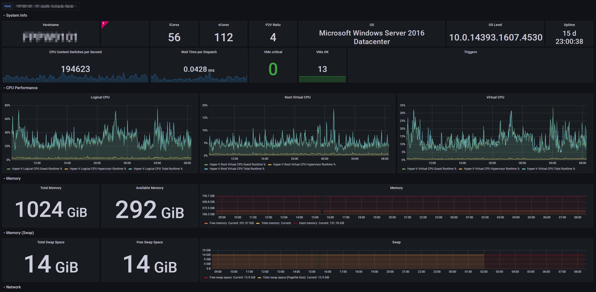
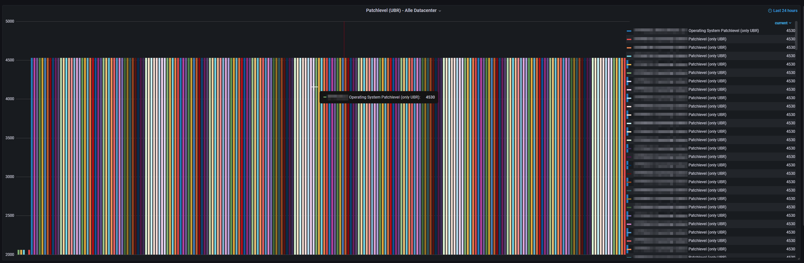

# Zabbix Hyper-V Monitoring
This repository contains Zabbix Templates and Grafana dashboards for an awesome Hyper-V monitoring.

> Maybe for your environment you have to change some Zabbix items in the templates.

## Grafana Dashboards
### Windows - Fabric - Hyper-V
*This dashboard is for analyzing one Hyper-V node.*
* There is a dropdown to select the node you want.

### Windows - Fabric - Hyper-V (all Nodes) - TV
*This dashboard is for checking all your Hyper-V nodes on the same time to quickly see peaks.*
_-_TV.png)

### Windows - Fabric - Hyper-V (all Nodes) - Patchlevel
*This dashboard is for quickly see all patchelevels from the Hyper-V nodes.*

> This repository will be not supported in the future. Because we switch to the TIG-Stack (Telegraf, InfluxDB, Grafana)

## License
Copyright 2021 Robin Hermann

Licensed under the Apache License, Version 2.0 (the "License"); you may not use this file except in compliance with the License. 
You may obtain a copy of the License at

http://www.apache.org/licenses/LICENSE-2.0

Unless required by applicable law or agreed to in writing, software distributed under the License is distributed on an "AS IS" BASIS, WITHOUT WARRANTIES OR CONDITIONS OF ANY KIND, either express or implied. See the License for the specific language governing permissions and limitations under the License.